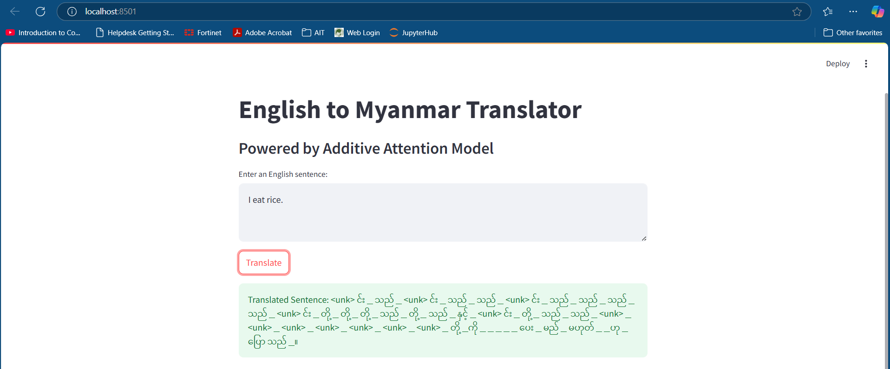

# NLP Assignment 3 - Machine Translation
- [Student Information](#student-information)
- [Project Overview](#2-project-overview)
- [File Structure](#3-file-structure)
- [Dataset](#4-dataset)
- [Attention Mechanisms Implemented](#5-attention-mechanisms-implemented)
- [Training Results](#6-training-results)
- [Web Application](#7-web-application)
- [Model Details](#8-model-details)
- [Conclusion](#9-conclusion)

## 1. Student Information
- **Name:** Phue Pwint Thwe
- **ID:** st124784

## 2. Project Overview
This project focuses on **Machine Translation** from **English to Myanmar** using a **Sequence-to-Sequence Transformer model** with various attention mechanisms.

## 3. File Structure
- **app/** → Web application source code:
  - `app.py` → streaamlit application.
  - `models/` → Pre-trained PyTorch models.

## 4. Dataset
- **Source**: [ALT Corpus](https://www2.nict.go.jp/astrec-att/member/mutiyama/ALT/) and (https://huggingface.co/datasets/myothiha/mm_eng_alt_corpus)
- **Split**: Training (187,641), Validation (20,850), Testing (23,166)
- **Preprocessing**:
  - Tokenized Myanmar text using **mbart-large-50** library.

## 5. Attention Mechanisms Implemented
- **General Attention**
- **Multiplicative Attention**
- **Additive Attention**

## 6. Training Results
| Attention Mechanism | Training Loss | Training PPL | Validation Loss | Validation PPL |
|--------------------|--------------|-------------|----------------|--------------|
| General           | 5.504         | 245.681       | 7.954           | 2846.314       |
| Additive         | 5.506         | 246.109       | 7.351           | 1557.283      |
| Multiplicative   | 3.329         | 27.907       | 3.262           | 26.114       |

## 7. Web Application

- **Usage**:
  - Enter English text in the input box.
  - Click "Translate".
  - View the Myanmar translation output.

- **Features**
- Powered by an Additive Attention mechanism for effective sequence-to-sequence learning.
- Supports real-time English-to-Myanmar translation.
- Deployed using the Streamlit framework for a simple user interface.

## 8. Model Details
- **Architecture**:
  - Encoder & Decoder with Multi-Head Self-Attention.
  - Implemented in PyTorch.
- **Training**:
  - Adam Optimizer with scheduled learning rate.
  - Loss function: Cross-Entropy.
- **Inference**:
  - Pre-trained models stored in `models/` folder.

## 9. Conclusion
- **Additive Attention** performed best with the lowest validation loss.
- The trained model is deployed as a web service for real-time translation.

## Key Issues
- Tokenizer mismatch between MBart50 and custom vocabularies during training and inference caused `<unk>` tokens to dominate the output. 

## Further Improvements
- Fine-tune the model with a larger Myanmar-specific dataset.
- Standardize tokenization using the MBart50 tokenizer for the entire pipeline or using pyidaungsu tokenizer.
- Add error handling for unsupported inputs.

## Limitations
- Custom vocabulary restricts compatibility with pre-trained MBart models.
- Translation quality is constrained by the training dataset size and diversity.
- Time limitation for this assignment.

## Application Screenshot

---
